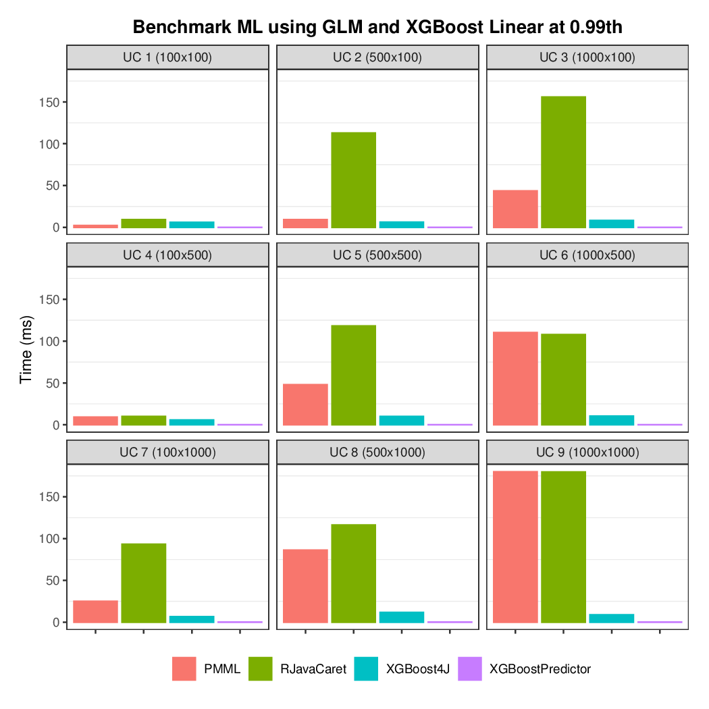

# Benchmark XGBoost libraries for Java

## Introduction
This repository contains the code that served as base for results I have discussed at [Fast Machine Learning Predictions](https://medium.com/blablacar-tech/fast-machine-learning-predictions-6856b3623e5) article. The goal is to share the code, keep adding other libraries and improving the benchmark to be as most accurate as possible.

As XGBoost is a mainstream machine learning method and many applications are running Java, there are many implementations of XGBoost for Java and libraries that are not specific for Java such as rJava with XGBoost running inside R. The ones compared at the moment are:

* [JPMML](https://github.com/jpmml/jpmml-evaluator):
* [XGBoost4J](https://github.com/dmlc/xgboost/tree/master/jvm-packages)
* [XGBoost Predictor](https://github.com/komiya-atsushi/xgboost-predictor-java)
* [RJava](https://github.com/s-u/rJava) with [XGBoost from Caret](https://github.com/topepo/caret)

## Benchmark

The prediction latency is the metric evaluated. For each of the libraries above we benchmark 9 use cases (UC):

The benchmark uses [JMH](https://openjdk.java.net/projects/code-tools/jmh/) and the results are in the [charts](charts) folder, they are separated by either linear or tree booster type and percentile. The benchmark has been executed with 2 warm-up iterations and 5 measurement iterations.

The [charts.R](charts/charts.R) file is the R script used to generate the PDF charts. The benchmark results were created using my personal computer running a [Intel(R) Core(TM) i7-4600U CPU @ 2.10GHz](https://ark.intel.com/content/www/us/en/ark/products/76616/intel-core-i7-4600u-processor-4m-cache-up-to-3-30-ghz.html).

https://octodex.github.com/images/yaktocat.pngThe models used for predictions are not in this repository as their files are too large to be checked in into Github, which limits to 100MB per file. You can download the compressed models [here](https://drive.google.com/open?id=1wh_sr75q1-Q5cteoXrA9FsR-G1378gYQ) and extract them in the [resources](src/main/java/resources) folder.

## Some results

For all the results please check the [charts](charts) folder. The results show below are for both linear and tree booster types and
show the 99th percentile for the prediction latency in milliseconds.

### Tree

### Linear

## Future work

* Add other libraries
** [Treelite](https://github.com/dmlc/treelite)
** XGBoost using Python with [JEP](https://github.com/ninia/jep) or other Java to Python library.
* Add a ThreadPoolExecutor in order to parallelize the execution of predictors that [do not allow parallel](https://github.com/edumucelli/benchmark-xgboost-java/blob/master/src/main/java/benchmark/predictor/PMMLPredictor.java#L69) evaluation such as JPMML
